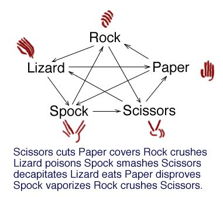

# Rock Paper Scissors Lizard Spock!

Game Inputs

- Users can determine the number of rounds per game

- Users can determine if the game should consist of two human players or one human vs a computer

Game Rules

 The winning gesture for each round is determined by the below comparisons:
 Rock crushes Scissors
 Scissors cuts Paper
 Paper covers Rock
 Rock crushes Lizard
 Lizard poisons Spock
 Spock smashes Scissors
 Scissors decapitates Lizard
 Lizard eats Paper
 Paper disproves Spock
 Spock vaporizes Rock

 After all rounds are complete, the player with the most round wins will be the overall game winner.

